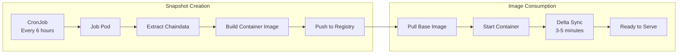

# Ethereum Node Infrastructure Architecture

## Overview

This document describes a production-ready Ethereum blockchain infrastructure designed for scalability, reliability, and operational efficiency. The architecture addresses the fundamental challenge in blockchain infrastructure: **separating stateful sync operations from stateless RPC serving** to enable fast horizontal scaling.

## Problem Statement

Traditional Ethereum node deployments face a critical scaling bottleneck:
- **Blockchain Sync**: Requires 3-7 days, persistent storage, and stateful operations
- **RPC Traffic**: Requires fast scaling, low latency, and stateless operations
- **Challenge**: Cannot quickly scale RPC capacity due to long sync times

## Solution Architecture

### High-Level Architecture

### Data Flow Architecture

## Component Architecture

### 1. Sync Nodes (StatefulSets)

**Purpose**: Maintain full blockchain state synchronization

**Key Characteristics:**
- **Single replica** per client type
- **Persistent storage** with high IOPS requirements
- **Long-running** with continuous P2P synchronization
- **Resource intensive** during initial sync
- **Stable network identity** for peer discovery

### 2. Serve Nodes (Deployments + HPA)

**Purpose**: Handle RPC traffic with horizontal scaling

**Scaling Behavior:**
- **Fast startup**: 3-5 minutes vs. 3-7 days
- **Stateless**: No persistent storage required
- **Auto-scaling**: Based on CPU/memory metrics
- **Delta sync**: Only catch up recent blocks on startup

### 3. Snapshot Pipeline

**Purpose**: Enable fast RPC node provisioning

## Infrastructure as Code Structure

## Deployment Strategy

### Phase 1: Infrastructure Bootstrap
1. **Kind cluster** with 3 worker nodes
2. **MetalLB** for LoadBalancer services
3. **Local registry** for container images
4. **Storage classes** and persistent volumes

### Phase 2: Observability Stack
1. **Prometheus** for metrics collection
2. **Grafana** for dashboards and visualization
3. **Loki** for log aggregation
4. **Service monitors** for Ethereum-specific metrics

### Phase 3: Ethereum Infrastructure
1. **Sync nodes** deployment (StatefulSets)
2. **Initial sync** (3-7 days for full sync)
3. **Snapshot jobs** setup and first execution
4. **Serve nodes** deployment with HPA

### Phase 4: Production Optimization
1. **Performance tuning** based on metrics
2. **Alert rules** for operational monitoring
3. **Backup strategies** for disaster recovery
4. **Security hardening** and network policies

## Scaling Characteristics

### Sync Node Scaling
- **Vertical scaling**: Increase CPU/memory for faster sync
- **Client diversity**: Multiple implementations for resilience
- **Storage scaling**: Automatic volume expansion capabilities

### RPC Node Scaling
- **Horizontal scaling**: 2-20 replicas based on traffic
- **Fast provisioning**: 3-5 minute startup time
- **Load distribution**: Even traffic distribution across pods
- **Auto-scaling metrics**: CPU (70%) and Memory (80%) thresholds

## Operational Considerations

### Monitoring Strategy
- **Node health**: Sync status, peer count, block height
- **Performance**: RPC latency, throughput, error rates
- **Infrastructure**: Resource utilization, storage growth
- **Business**: Request patterns, client diversity

### Backup and Recovery
- **Snapshot strategy**: Container images for fast recovery
- **Persistent volume backups**: Daily snapshots to object storage
- **Multi-region**: Geographic distribution for disaster recovery

### Security Considerations
- **Network policies**: Segmented network access
- **RBAC**: Least privilege access controls  
- **TLS encryption**: All inter-service communication
- **Resource limits**: Prevent resource exhaustion attacks

## Production Readiness Checklist

- [ ] **Multi-client deployment** for network resilience
- [ ] **Monitoring and alerting** for all components
- [ ] **Backup and disaster recovery** procedures
- [ ] **Security hardening** and network segmentation
- [ ] **Performance testing** and capacity planning
- [ ] **Runbook documentation** for operations team
- [ ] **Incident response** procedures
- [ ] **Cost optimization** strategies

## Conclusion

This architecture addresses the fundamental scalability challenges of blockchain infrastructure by:

1. **Separating concerns** between sync and serve operations
2. **Enabling fast scaling** through snapshot-based provisioning
3. **Maintaining reliability** through client diversity and monitoring
4. **Supporting operations** with comprehensive observability

The design reflects production patterns used by major blockchain infrastructure providers while remaining deployable on local Kubernetes clusters for development and testing.